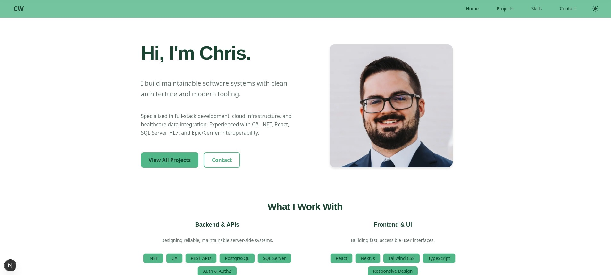

# Christopher Wenzlick — Portfolio Website

Personal portfolio site built with **Next.js 15**, **Tailwind CSS v4**, and **MDX**. Fully static, zero runtime server, deployed on Vercel.

**→ [chriswenzlick.com](https://chriswenzlick.com)**



---

## Tech Stack


| Layer | Technology |
|---|---|
| Framework | Next.js 15 (App Router) |
| UI | React 19, Tailwind CSS v4, Embla Carousel |
| Primitives | CVA, Radix UI Slot, clsx, tailwind-merge |
| Content | MDX + TypeScript data files |
| Fonts | Geist (via `next/font` — zero layout shift) |
| Tooling | TypeScript 5 strict mode, ESLint |
| Analytics | Vercel Analytics + Speed Insights |
| Hosting | Vercel |

---

## Highlights

- **Fully static** — all pages pre-rendered at build time via SSG; no origin server or cold starts at runtime
- **MDX as a CMS** — adding a project means dropping one `.mdx` file into `src/content/projects/`; it is automatically picked up by the sitemap, search filters, and featured lists at the next build
- **Responsive** — mobile-first layout with a custom accordion table component that converts wide data tables into expandable card rows on small screens
- **Dark mode** — CSS custom property token system with a user-toggleable dark theme; no runtime CSS-in-JS cost
- **SEO** — auto-generated `sitemap.xml` and `robots.txt`; per-page Open Graph and Twitter card metadata; `dynamicParams = false` on detail pages so unknown slugs 404 immediately rather than triggering a slow runtime render
- **Security headers** — `X-Content-Type-Options`, `X-Frame-Options`, `Referrer-Policy`, and `Permissions-Policy` applied globally via `next.config.ts`

---

## Lighthouse Scores

All five pages score 90+ across every category, with perfect 100s on Best Practices and SEO site-wide.

| Page | Performance | Accessibility | Best Practices | SEO |
|---|:---:|:---:|:---:|:---:|
| `/` | 97 | 91 | 100 | 100 |
| `/projects` | 98 | 96 | 100 | 100 |
| `/projects/[slug]` | 98 | 94 | 100 | 100 |
| `/skills` | 99 | 95 | 100 | 100 |
| `/contact` | 98 | 95 | 100 | 100 |

---

## Project Structure

```
src/
├── app/                    # Next.js App Router pages
│   ├── page.tsx            # Home
│   ├── projects/           # Project list + [slug] detail pages
│   ├── skills/             # Skills overview
│   ├── contact/            # Contact page
│   ├── sitemap.ts          # Auto-generated sitemap
│   └── robots.ts           # Auto-generated robots.txt
├── content/
│   ├── projects/           # One .mdx file per project
│   ├── skills.ts           # Skill definitions and metadata
│   └── testimonials.ts     # Testimonial data
└── lib/
    ├── projects.ts         # Reads and indexes MDX files at build time
    └── utils.ts

components/
├── layout/                 # Header, Footer, ProjectMeta, NavBar
└── ui/                     # Badge, Button, Card, Carousel, SkillBadge, etc.
```

---

## Getting Started

Node 18+ required.

```bash
npm install
npm run dev       # development server → http://localhost:3000
npm run build     # production build (runs type checking and lint)
npm run start     # serve the production build locally
```

---

## Adding a Project

1. Create `src/content/projects/your-project-slug.mdx`
2. Export a `metadata` object at the top of the file (see below)
3. Write the project write-up in MDX below the export
4. Run `npm run build` — the project is automatically included in the sitemap, project list, skill filters, and (if `featured: true`) the homepage

```mdx
export const metadata = {
  title: "Your Project Title",
  description: "One-sentence description shown in cards and meta tags.",
  featured: false,
  repo: "https://github.com/you/your-repo",
  live: "https://your-project.com",
  skillSlugs: ["nextjs", "typescript"],
  images: [{ src: "/images/your-project/screenshot.jpg", alt: "Alt text" }],
  createdDate: "2026-01-01",
  lastUpdatedDate: "2026-01-01",
};

## Overview

Your write-up here...
```

See [`src/content/projects/portfolio-site.mdx`](src/content/projects/portfolio-site.mdx) for a full example.
